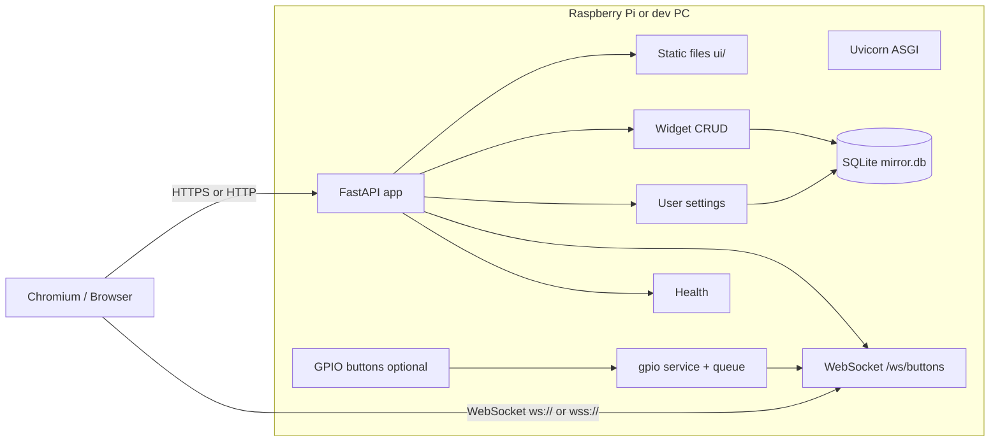

# Smart Mirror — system architecture report

This document describes the current Smart Mirror software stack: overall design, backend and frontend components, network protocols, HTTP/WebSocket APIs, gaps between the UI client and server, and practical guidance for running a local server that serves client apps (including authentication and trust on a home LAN or dedicated device).

---

## 1. Executive summary

| Layer | Technology | Role |
|--------|------------|------|
| **Server** | Python 3, **FastAPI**, **Uvicorn** | REST API, WebSocket for GPIO button events, static UI under `/ui` |
| **Persistence** | **SQLite** via **SQLAlchemy** | Widget layout rows, user display settings |
| **Hardware bridge** | `hardware/gpio/` (optional `ENABLE_GPIO`) | Physical buttons → in-process queue → WebSocket broadcast |
| **Client** | **Vanilla ES modules** (no React/Vue), HTML/CSS | Mirror dashboard, widgets, optional camera UX |
| **Auth (current)** | **None** | All API routes are unauthenticated; suitable only for trusted local use unless extended |

The mirror is designed as a **single-user, local-first** appliance: one browser session (often Chromium kiosk) talks to one backend on the same machine or LAN.

### Quick guide in simple terms

- **Section 2 (system design):** shows the "big picture" of what talks to what.
- **Section 3 (backend):** explains the Python server parts and what each one does.
- **Section 4 (frontend):** explains the browser app parts (layout, widgets, tools).
- **Section 5 (protocols):** explains which network protocols are used (HTTP/WebSocket).
- **Section 6 (HTTP API):** lists all REST endpoints that exist right now.
- **Section 7 (WebSocket API):** explains real-time button events.
- **Section 8 (missing routes):** calls out UI features that currently hit non-existent endpoints.
- **Section 9 (env vars):** runtime configuration flags.
- **Section 10 (auth/trust):** security reality and what to do on a LAN.
- **Section 11 (extension guidance):** practical advice when adding features.
- **Section 12 (operator checklist):** quick runbook before deploying/running.

---

## 2. Overall system design



**Request flow (typical):**

1. User opens `http://<host>:<port>/ui/` (or `/ui/index.html`).
2. The shell loads CSS and `app.js`, which may call `/api/...` and optionally open `ws://<host>/ws/buttons`.
3. Widget and user data are read/written through JSON REST endpoints; SQLite holds durable state.
4. If GPIO is enabled, button presses are read in the backend, mapped to effects in `button_service`, and **broadcast to all connected WebSocket clients** (fan-out).

---

## 3. Backend services (Python)

| Component | Path / module | Responsibility |
|-----------|----------------|----------------|
| **ASGI app** | `backend/main.py` | App factory: CORS, routers, `/ui` static mount, GPIO startup hook |
| **Widgets API** | `backend/api/widgets.py` | `GET/PUT /api/widgets/` |
| **User API** | `backend/api/user.py` | `GET/PUT /api/user/settings` |
| **Health** | `backend/api/health.py` | `GET /api/health` |
| **Events** | `backend/api/events.py` | `WebSocket /ws/buttons`; `POST /api/dev/buttons` (dev only) |
| **Widget service** | `backend/services/widget_service.py` | List/seed/replace widget rows |
| **User service** | `backend/services/user_service.py` | Get-or-create/update user settings |
| **Button service** | `backend/services/button_service.py` | Map `ButtonEvent` → `{ button_id, action, effect }` for WS payload |
| **DB session** | `backend/database/session.py` | SQLAlchemy engine, `init_db()` (create_all) |
| **Models** | `backend/database/models.py` | `WidgetConfig`, `UserSettings` |
| **Config** | `backend/config.py` | `DATABASE_URL` / `MIRROR_DB_PATH` → SQLite path |
| **GPIO** | `hardware/gpio/service.py` | Async queue of button events; mock-friendly |

**Dependencies** (`backend/requirements.txt`): `fastapi`, `uvicorn[standard]`, `httpx`, `python-multipart`, `sqlalchemy`, `alembic`, `pydantic`.

**Notable behaviors:**

- **CORS**: `allow_origins=["*"]`, `allow_credentials=False` — permissive for local dev; tighten for any exposed deployment.
- **Static UI**: Mounted at **`/ui`**, not at `/` (open `http://host:port/ui/`).
- **Database**: Default file `data/mirror.db` (under repo root when cwd is correct); overridable via env (see §9).

---

## 4. Frontend services (browser)

| Area | Location | Role |
|------|----------|------|
| **App shell** | `ui/src/App.tsx` | Layout modes, canvas, tools panel, camera overlay, persistence |
| **Build** | `ui/vite.config.ts`, `ui/package.json` | Vite + React; production assets in `ui/dist/` (served at `/ui`) |
| **HTTP client** | `ui/src/api/mirrorApi.ts` | `fetch` to `/api/widgets/`, `/api/user/settings` |
| **Transforms** | `ui/src/api/transforms.ts` | Maps backend `WidgetConfig` rows ↔ React `WidgetConfig` (grid + `config_json.freeform`) |
| **Widget registry** | `ui/src/registry.tsx` | `WIDGET_REGISTRY` maps `widget_id` → React widget component |
| **Layout / freeform** | `ui/src/components/WidgetFrame.tsx` | CSS grid placement + freeform drag/resize (pointer events) |
| **Styles** | `ui/src/App.css`, `ui/src/index.css` | Theming; user settings apply CSS vars (`--color-accent`, `--fs-display`) |
| **Local fallback** | `localStorage` key `mirror_dashboard_config` | Used when the API is unreachable |

**Frontend stack:** **React 18 + TypeScript + Vite**. The FastAPI app serves the built bundle from `ui/dist` at mount path `/ui` (see `backend/main.py`).

**Widget architecture (React):**

- Register components in `ui/src/registry.tsx` under `WIDGET_REGISTRY`.
- Backend persistence uses `/api/widgets/` (SQL rows: `widget_id`, grid `position_*` / `size_*`, and `config_json.freeform` for pixel layout).
- Layout mode cycling and tools are implemented in `App.tsx` / `ToolsPanel.tsx`.

### 4.1 Minimal template: adding a new widget (React)

1. Add a component and register it in `ui/src/registry.tsx` (`WIDGET_REGISTRY`).
2. Ensure the backend knows the `widget_id` string you use (or seed rows via API).
3. Run `cd ui && npm run build` before serving with the backend.

The following subsections retain **legacy vanilla JS** examples for historical reference only.

Minimal example:

```js
// ui/js/widgets/quote.js
import { BaseWidget, registerWidget } from "./base.js";
import { getDefaultWidgetLayout } from "./defaultLayouts.js";

class QuoteWidget extends BaseWidget {
  constructor() {
    const defaults = getDefaultWidgetLayout("quote");
    if (!defaults) throw new Error('Missing default layout for "quote"');
    super({
      id: "quote",
      title: "Quote",
      className: "widget--quote",
      defaults,
    });
  }

  beforeMount(surface, config) {
    // Optional: prepare state, read config, etc.
  }

  mount(container, config) {
    this.createShell(container);

    const text = document.createElement("div");
    text.className = "quote-text metric-secondary";
    container.appendChild(text);

    const update = (data) => {
      text.textContent = data?.quote || "Stay curious.";
    };

    update();
    return {
      update,
      settings: () => this.settings(),
      // Optional custom cleanup; called by runtime on teardown.
      destroy: () => {},
    };
  }

  afterMount(surface, config, mountResult) {
    // Optional: analytics hooks, post-render wiring, etc.
  }

  destroy(surface, config) {
    // Optional fallback cleanup.
  }
}

const quoteWidget = new QuoteWidget();
registerWidget(quoteWidget);
export default quoteWidget;
```

Add defaults for the new widget:

```js
// ui/js/widgets/defaultLayouts.js
{
  widget_id: "quote",
  enabled: true,
  position_row: 5,
  position_col: 1,
  size_rows: 1,
  size_cols: 2,
  options: { refreshIntervalMs: 60 * 1000 },
}
```

Then load it at startup:

```js
// ui/js/app.js
import "./widgets/quote.js";
```

---

## 5. Networking protocols

| Protocol | Usage | Notes |
|----------|--------|------|
| **HTTP/1.1** | REST, static files | Uvicorn; TLS optional (usually added via reverse proxy on Pi) |
| **WebSocket** | `/ws/buttons` | JSON messages for physical (or dev) button events |
| **HTTPS / WSS** | Optional | WebSocket clients should use `wss://` when the page is served over HTTPS |

**Same-origin rule:** The UI is intended to be served from the **same host and port** as the API (`/api`, `/ws/buttons`). If you host the UI elsewhere, you must configure CORS and WebSocket origins explicitly and point the React app’s API client (or Vite dev proxy) at the backend origin.

**Default ports (from docs/scripts):** Commonly `8000` or `8002` in examples; bind address `0.0.0.0` for LAN access from other devices.

---

## 6. HTTP API reference (implemented)

Base path: **`/api`** (unless you mount the app behind a prefix).

| Method | Path | Description |
|--------|------|-------------|
| `GET` | `/api/widgets/` | List widget configurations (DB; seeds defaults if empty) |
| `PUT` | `/api/widgets/` | Replace/update widget set (JSON array, see Pydantic schemas) |
| `GET` | `/api/user/settings` | Get user display settings |
| `PUT` | `/api/user/settings` | Partial update of theme, font size, accent color |
| `GET` | `/api/health` | Liveness: `{ "status": "ok" }` |

**Pydantic models** (request/response shapes): `backend/schemas/widget.py`, `backend/schemas/user.py`.

**Widget row fields (conceptual):** `widget_id`, `enabled`, grid `position_*`, `size_*`, optional `config_json` for per-widget options.

---

## 7. WebSocket API (implemented)

- **URL:** `ws://<host>:<port>/ws/buttons` or `wss://...` under HTTPS.
- **Server behavior:** On connect, server accepts and registers the socket; it **broadcasts** each processed button event to **all** connected clients (see `ConnectionManager` in `backend/api/events.py`).
- **Message shape (client inbound):** JSON with at least:
  - `type`: `"button"`
  - `button_id`, `action`, `effect` (strings; values aligned with `hardware.gpio` enums and `button_service`)

**Development helper:**

| Method | Path | Condition |
|--------|------|-----------|
| `POST` | `/api/dev/buttons` | Query params `button_id`, `action`; only if `ENABLE_DEV_ENDPOINTS=true` |

---

## 8. Client API calls present in UI but not implemented on server

The file `ui/js/api.js` also references endpoints that **do not appear in `backend/main.py`** today:

| Client function | Intended path | Purpose |
|-----------------|---------------|---------|
| `getCameraFeedSource` | `GET /api/camera/feed` | Return camera stream metadata (e.g. URL) |
| `postExternalHookEvent` | `POST /api/integrations/hooks/events` | Forward mirror events to integrations |
| `getExternalHookManifest` | `GET /api/integrations/hooks` | Describe available hooks |

**Implication:** Those `fetch` calls will **404** unless you add matching routes. The UI catches some failures (e.g. camera) and degrades. When designing your server, either implement these routes or remove/replace them in the client.

---

## 9. Environment variables (backend / runtime)

| Variable | Purpose |
|----------|---------|
| `DATABASE_URL` | Full SQLAlchemy URL (overrides file path) |
| `MIRROR_DB_PATH` | Path to SQLite file (alternative to default `./data/mirror.db`) |
| `ENABLE_GPIO` | If `true`, start GPIO button polling on app startup |
| `ENABLE_DEV_ENDPOINTS` | If `true`, enable `POST /api/dev/buttons` |

---

## 10. Authentication, authorization, and local trust

**Current state:** There is **no** API key, session cookie, JWT, or OAuth in this repository. Any client on the network that can reach the host can call `GET/PUT` on widgets and user settings and open the WebSocket.

**Implications for a “server for client-side apps” on local hardware:**

1. **LAN-only binding:** Run Uvicorn on `127.0.0.1` if only localhost clients are allowed; use `0.0.0.0` only on a trusted network or with additional controls.
2. **Reverse proxy:** Put **Caddy** or **nginx** in front with:
   - TLS (self-signed or local CA),
   - Optional **HTTP Basic** or **mTLS** for admin routes,
   - Rate limiting if exposed.
3. **Application-level tokens:** Add a static **Bearer token** or **HMAC-signed requests** for `/api/*` and validate in FastAPI dependencies (simplest for a single-home device).
4. **WebSocket auth:** Reject `websocket.accept()` until a query param or first message carries a valid token (or use cookie-based session if same-site).
5. **Single-user appliance:** Many mirrors treat the device as **physically secure** and skip remote auth; still protect **SSH** and **Pi user accounts**.

**Privacy / camera:** Camera paths should remain **opt-in** in the UI; any future `/api/camera/feed` should not expose wide-area URLs without explicit user consent.

---

## 11. Guidance for developing or extending the server

1. **Preserve API contracts** for `GET/PUT /api/widgets/` and `GET/PUT /api/user/settings` if existing clients should keep working; extend with new fields via `config_json` or new columns with migrations.
2. **Implement missing routes** from `api.js` if you need integrations or camera metadata, or point `API_BASE` at a gateway that implements them.
3. **WebSocket:** Ensure only one source of truth for button events (GPIO queue vs. dev inject) to avoid duplicate broadcasts if you add more producers.
4. **Migrations:** The app uses `create_all` today; for production evolution, introduce **Alembic** migrations and version the schema.
5. **Multi-client:** WebSocket broadcast means every connected tab receives button events; filter by `client_id` if you add pairing later.

---

## 12. Summary checklist for operators

- [ ] Run backend with `uvicorn backend.main:app --host ... --port ...` from repo root.
- [ ] Open UI at **`/ui/`** on the same origin as the API.
- [ ] Know that **auth is absent**; secure the network or add proxy/token auth.
- [ ] Use **`ENABLE_GPIO=true`** only on hardware with the GPIO stack wired and tested.
- [ ] Align **`buttons.js`** with **`app.js`** if you want WebSocket-driven buttons instead of keyboard-only `localInput.js`.
- [ ] Implement **`/api/camera/*`** and **`/api/integrations/*`** if you rely on those client methods.

---

*Generated from repository state; route list verified against `backend/main.py` and `backend/api/*`. Update this document when new routers are added.*
